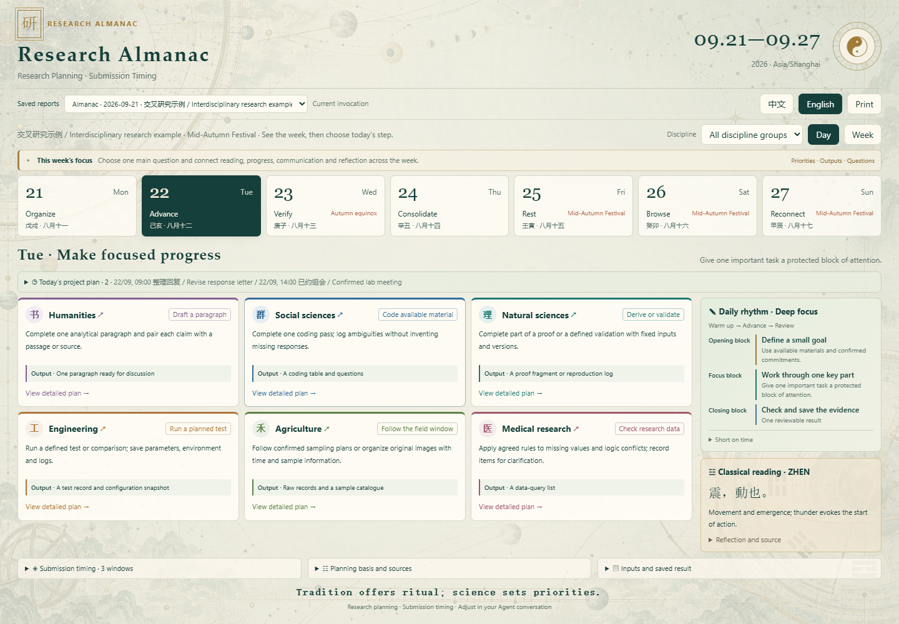
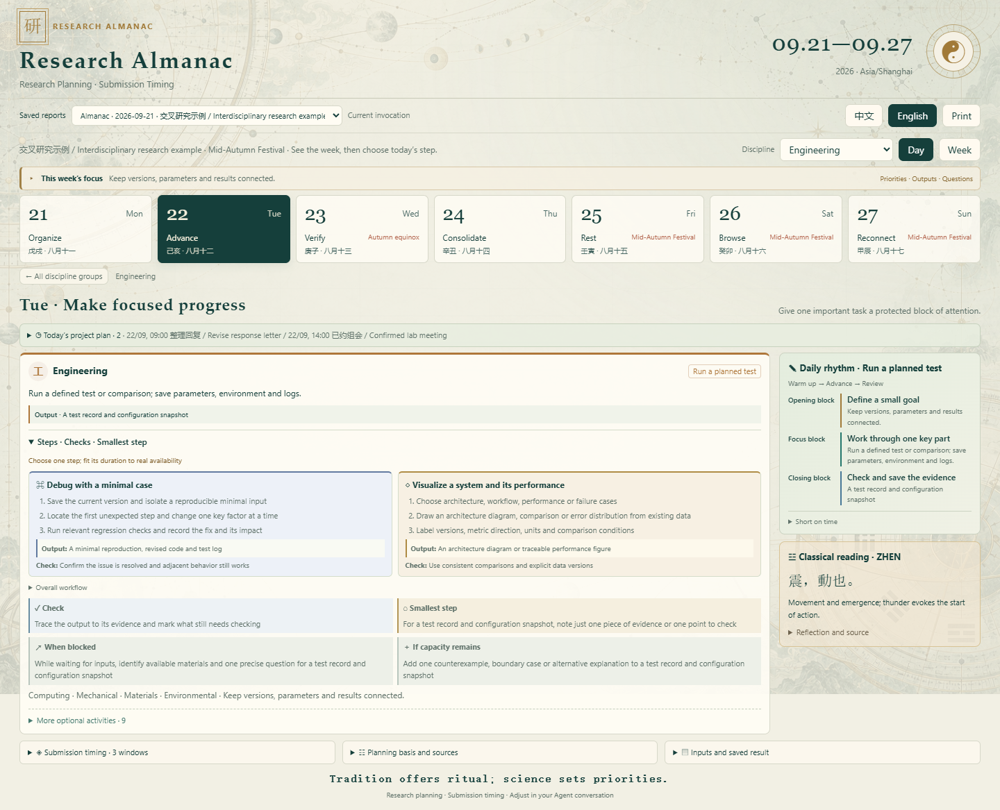
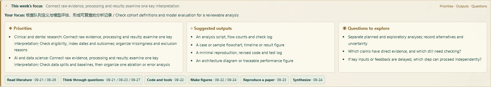
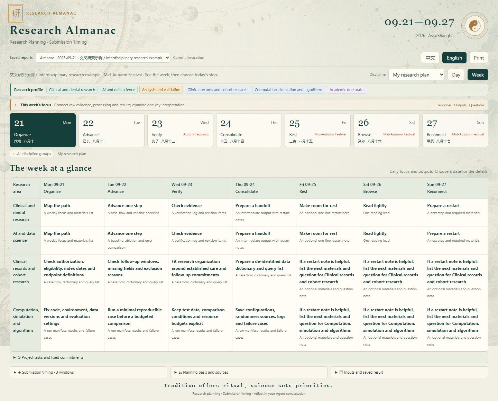
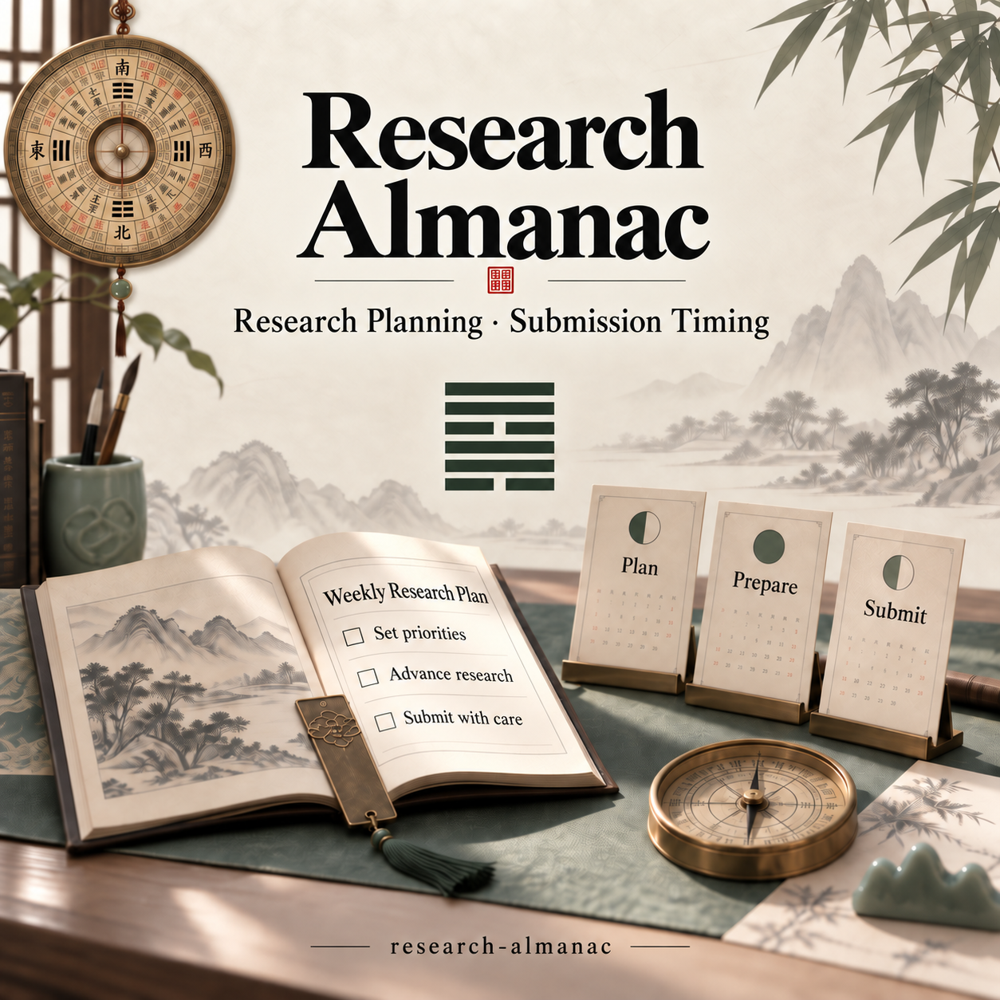

<a href="./README.md">简体中文</a> · <strong>English</strong>

# Research Almanac

**Research Planning · Submission Timing**

Plan your research week, then choose a submission window for a prepared manuscript.

An Agent Skill for master’s and doctoral researchers across fields. It adapts weekly guidance to your research direction, methods and stage, with concrete actions, expected outputs and sourced Yijing readings. When submission is relevant, expand the existing planner for exact times, facing directions, trigrams and supporting evidence.

<strong>Tradition offers ritual; science sets priorities.</strong>

v0.13.0 · Node.js 22+ · Local computation · Offline bilingual HTML · MIT

[Features](#a-clearer-research-week) · [Quick start](#quick-start) · [Submission timing](#submission-timing) · [Saved reports](#one-invocation-one-saved-record) · [Planning rules](#how-the-plan-is-built)

## A clearer research week

| Feature | What you get |
|---|---|
| Seven-day almanac | Local Monday–Sunday dates, daily themes, supported calendar facts and saved holidays |
| Research directions | 14 lookup categories, 38 direction templates, combined fields and custom specialties |
| Methods and stages | 12 research methods and 9 stages, with different guidance for proposals, analysis, writing and revision |
| Six overview groups | Click humanities, social sciences, natural sciences, engineering, agriculture or medicine to open its detailed plan |
| Open execution checklists | Steps, outputs, checks, a smallest useful step and alternatives are visible by default |
| 9 activity types | 54 discipline-specific guides for reading, figures, synthesis, thinking, reproduction, experiments, code, writing and discussion |
| Rich weekly focus | Priorities, suggested outputs, useful questions and dates for each activity |
| Varied daily rhythms | Organize, advance, check, discuss, consolidate, recover, read and reconnect |
| Project scheduling | Tasks arranged around durations, dependencies, deadlines, availability and fixed commitments |
| Weekly overview | Seven days for selected fields and methods; click a subject, date or cell to open the details |
| Original passages | Trigram passages, chapter references, plain-language meanings and modern reflections |
| Chinese / English | Offline translations of the interface and built-in guidance, preserving user text and classical originals |
| Saved reports | Switch between research almanacs and the original submission reports |

Execution checklists open by default and start with the day’s priority activities. Expand “More optional activities” for additional choices: tracing arguments in humanities, checking variables in social sciences, reproducing derivations in science, debugging in engineering, organizing field records in agriculture and reviewing research records in medicine.

The weekly focus brings together priorities, suggested outputs and questions to explore, followed by the suggested dates for reading, reproduction, figures and other activities.

Provide a research profile to open on “My research plan”; clinical record analysis, lab research, creative practice and textual research receive different guidance. Without a profile, the six-group overview remains available. Add actual project tasks for a schedule that reflects your constraints. Tasks without estimates or feasible slots remain visible for follow-up; planning them does not mark them completed.

## Quick start

### 1. Keep the complete Skill folder

Download the [repository](https://github.com/Mickey5920/research-almanac), extract the complete `research-almanac` folder and place it in a Skill directory supported by your Agent host. The invocation name is now `$research-almanac`. Preserve your existing local history directory when upgrading.

Install Node.js 22+, then run once from the Skill folder:

~~~sh
npm ci --ignore-scripts
~~~

After installation, the local engine and exported HTML require no model API key. The Agent host uses its own model configuration.

### 2. Ask in the Agent conversation

> Use $research-almanac to build next week's research almanac and weekly work plan across all six disciplines. My timezone is Asia/Shanghai. Keep research planning primary, add submission timing when relevant, and save an offline HTML report with Chinese/English switching.

For tailored guidance:

> I am a doctoral researcher combining clinical research and AI, currently analyzing data using cohort methods and computation. Focus on cohort definitions, data splits and model evaluation. Include daily steps, outputs, checks and a smallest useful step; keep other disciplines available through the selector.

For a specific project:

> Plan next week around my specified paper project. I need to check figures, revise the response letter and confirm attachments. Read the available tasks and deadlines; I have a lab meeting on Tuesday afternoon. Include submission windows if preparation and availability permit.

For an adjustment:

> Focus on engineering. Wednesday morning is unavailable; keep unfinished validation on the follow-up list. Preserve the other conditions and generate a new report.

**The conversation is the input surface. HTML only displays saved records; it has no AI connection and requires no browser form or server.**

### 3. Run a reproducible example

~~~sh
# General research almanac
node scripts/cli.js weekly examples/weekly.json --out runs/first-week

# Personal plan with submission timing
node scripts/cli.js weekly examples/weekly-personalized.json --out runs/personal-week

# Available directions, methods and stages
node scripts/cli.js profile-catalog
~~~

Open **report.html** in the output directory. Examples use fixed synthetic dates and tasks. For real use, remove `now` and supply actual project facts. Use a new output directory for each invocation.

## Submission timing

Research tasks are scheduled first; submission uses the remaining availability. Expand the support area for preferred and alternative windows, then open the full embedded report for directions, trigrams, personal zodiac interpretation and evidence.

| Preserved capability | Where it appears |
|---|---|
| Exact submission times | Local operation windows and suggested click times |
| Facing guidance | Direction, bearing and fixed-north compass in the full report |
| Trigram passages | Saved direction mapped to a Later Heaven trigram, with text and explanation |
| Optional personal zodiac | Existing cultural analysis after practical and academic priorities |
| Academic evidence | Saved venue instructions, sources, timezones and actual deadline rules |
| Plan lifecycle | Comparison, selection, review, preparation backplanning and actual submission records |

An explicit submission-only request still works:

~~~sh
node scripts/cli.js recommend examples/project.json --out runs/submission-only
~~~

See the [submission guide](docs/SUBMISSION-GUIDE.en.md) for complete usage and the original interface. Pending preparation tasks keep submission results conditional; an unscheduled required task prevents this run from offering submission windows.

## One invocation, one saved record

~~~text
runs/project-week/
  report.html              Almanac with expandable submission timing
  input.json               Complete saved input
  weekly.json              Seven-day structured result
  record.json              Paired input and result
  report.md / report.en.md Chinese and English reading versions
  manifest.json            Version and run metadata
  submission.json         When enabled: original engine result
  submission.html         When enabled: standalone full submission report
  submission-windows.ics  When feasible: candidate calendar events
~~~

Each invocation appends an independent record to `.local-data/history/`. Legacy submission records remain readable. Keep that directory across upgrades, or use the same private `--history-dir`. Runs and history are excluded from Git and release packages.

To view existing records without a new calculation:

~~~sh
node scripts/cli.js history-html --out runs/history-view.html
~~~

The HTML embeds the saved inputs, results, images and display logic. New requests produce new snapshots. Opening an old report never recomputes its contents.

View the Chinese interface

## How the plan is built

**Actual constraints → research tasks → submission windows in remaining time → cultural reflection.**

- Defaults reserve a 20% daily buffer and allow up to three project tasks per day; both are adjustable. General discipline suggestions are not appointments.
- Confirmed experiments, sampling windows, clinical duties and research follow-up retain their actual schedules. Rest days can remain open.
- The package includes the official 2026 mainland China holiday table. Other years use a labelled weekday fallback. Local weekly planning works in other IANA timezones.
- Classical passages come from the Zhouyi's Shuogua and follow workflow themes. Submission-facing trigrams retain the existing direction mapping. Interpretations and calendar facts remain distinguishable.
- Applicable verified academic evidence takes priority over traditional timing. A single study does not establish a universal weekend rejection rule; no personal acceptance probabilities are produced.

The task library, rhythms and scheduling defaults are planning suggestions. Scheduling is sequential for one person without overnight task splits. Multi-person optimization, full Qimen/Bazi/Meihua calculation and automatic submission are not implemented. See the [integration guide](docs/RESEARCH-ALMANAC.md) for the exact input contract and scope.

The direction templates and six display groups are project-authored, not an exhaustive official degree-program catalog. Unlisted specialties can be supplied as custom text. See the [research profile guide](references/research-profile.md) for matching, defaults and scope.

## Development and distribution

~~~sh
npm test
npm run check
npm run pack:release
~~~

All required Skill files remain in one portable folder. The release exporter includes templates, rules, examples and assets, and excludes installed dependencies, private project history and caches.

[Skill entry](SKILL.md) · [Commands](docs/COMMANDS.md) · [Project guide](docs/PROJECT-GUIDE.md) · [Implementation status](docs/IMPLEMENTATION.md) · [License](LICENSE) · [Third-party notices](THIRD_PARTY_NOTICES.md)
