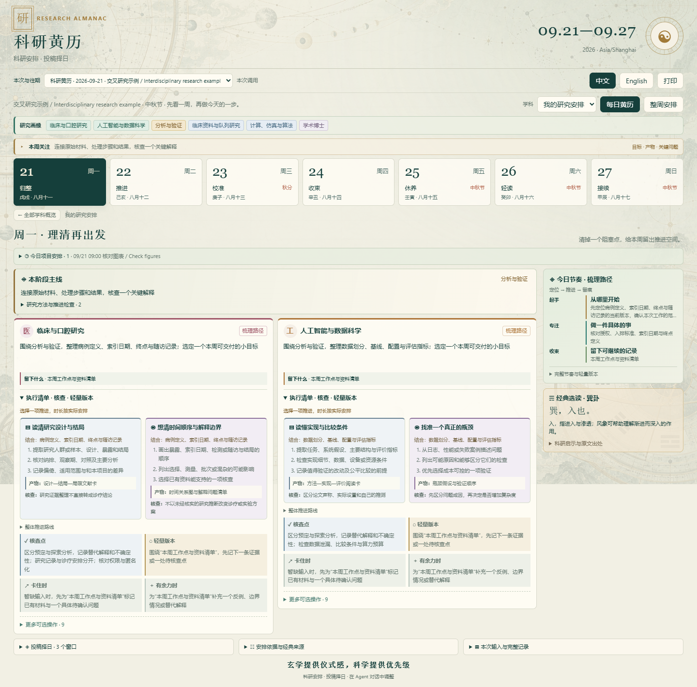
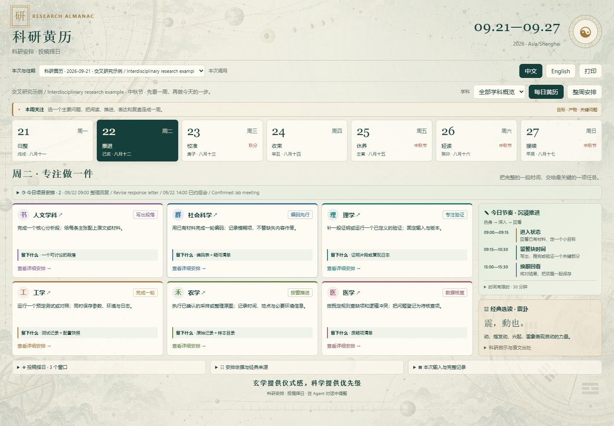
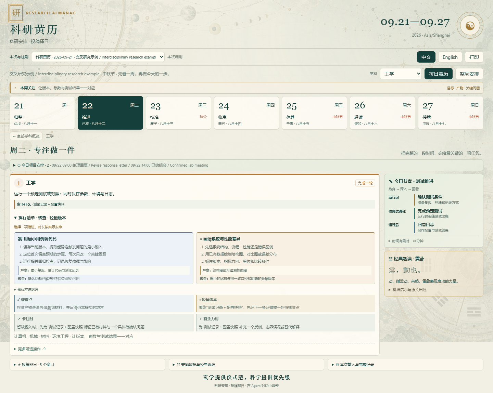
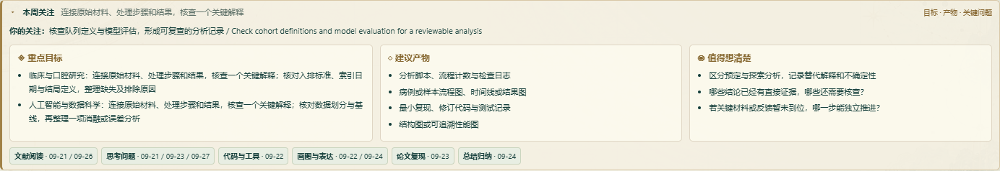
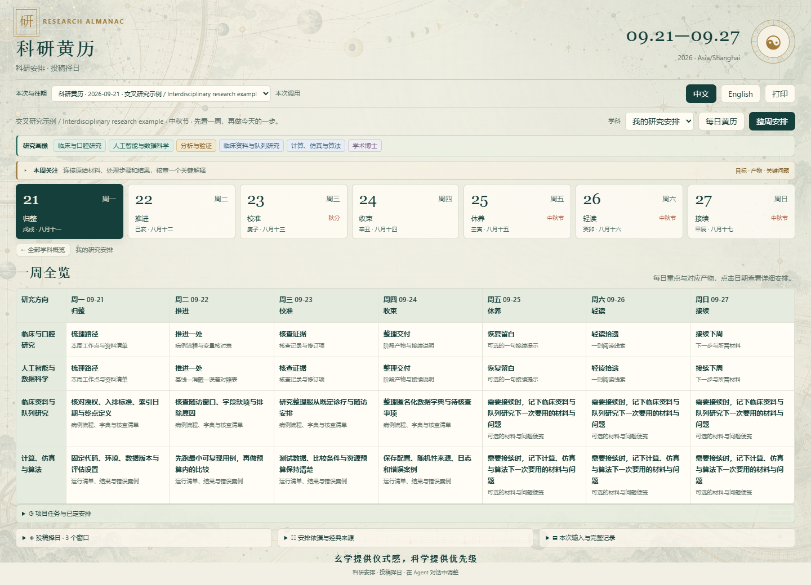
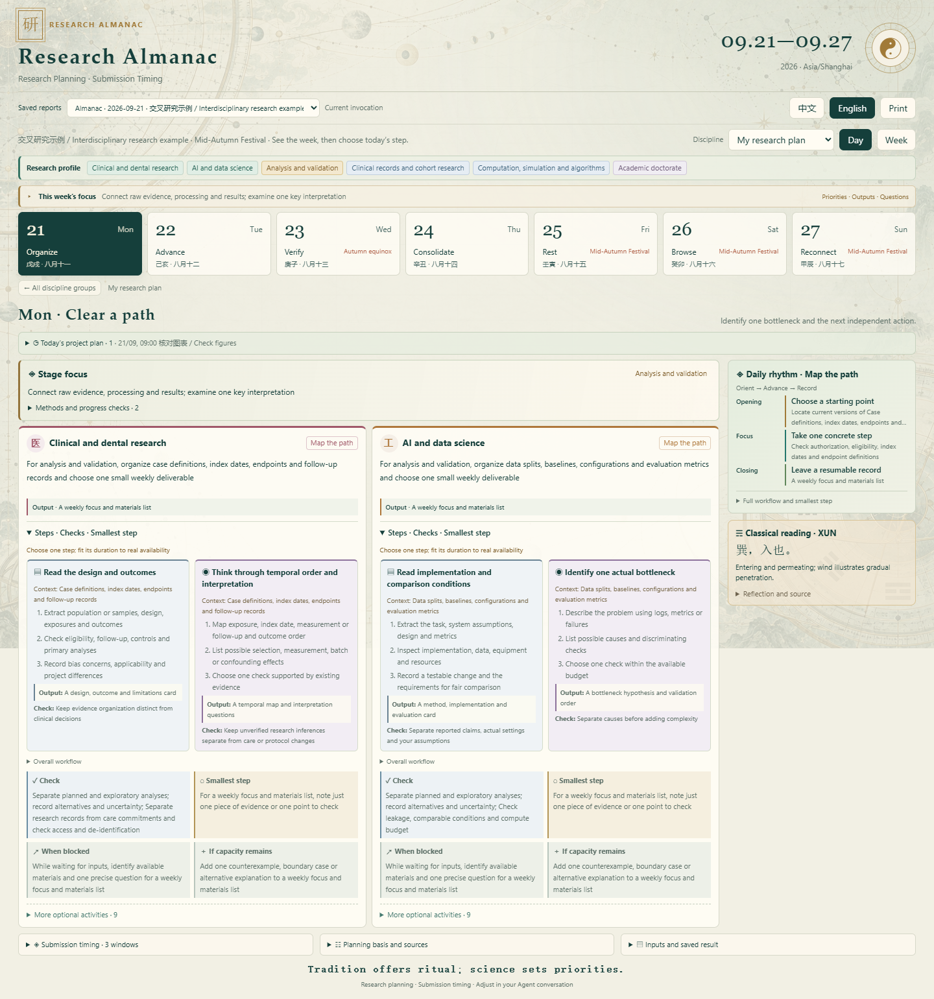

<strong>简体中文</strong> · <a href="./README.en.md">English</a>

# 科研黄历

**科研安排 · 投稿择日**

先安排一周科研，再为准备好的论文选择投稿时机。

面向多学科硕博，按专业、研究方式与阶段安排一周科研。一个可在 Agent 中调用的 Skill：把个人研究重点、具体行动、预期产物和周易选读放进一份紧凑的周计划。需要投稿时，再展开原有的具体时间、提交朝向、八卦解释与已有依据。

<strong>玄学提供仪式感，科学提供优先级。</strong>

v0.13.0 · Node.js 22+ · 本地计算 · 中英文离线 HTML · MIT

[功能](#把一周安排清楚) · [快速开始](#快速开始) · [投稿择日](#投稿择日) · [本地报告](#一次调用一份完整记录) · [规则与范围](#安排如何产生)

## 把一周安排清楚

| 功能 | 你会看到什么 |
|---|---|
| 七日科研黄历 | 按当地周一至周日显示日期、节气、假期与每日主题 |
| 专业与交叉方向 | 14 门类检索、38 个研究方向模板，支持多选与自填专业 |
| 方法与阶段适配 | 12 种研究方式、9 个阶段；开题、分析、写作、返修各有对应建议 |
| 六类概览 | 人文、社科、理学、工学、农学、医学；点击学科进入当天详细安排 |
| 默认展开的执行清单 | 直接查看步骤、产物、核查点、轻量版本和卡住时的选择 |
| 9 类科研操作 | 六大学科共 54 份操作指南：阅读、画图、总结、思考、复现、实验、代码、写作、讨论 |
| 更完整的本周关注 | 本周重点、建议产物、关键问题，以及操作对应的日期 |
| 多样的今日节奏 | 梳理、推进、核查、交流、收口、恢复、轻读、接续，随日期和学科变化 |
| 项目任务安排 | 按时长、依赖、截止和可用时段安排任务，避开已定事件 |
| 一周全览 | 按个人方向与方法查看七天安排；点击学科、日期或单元格直达详情 |
| 经典原文与解释 | 八卦原文、章节、白话解释与当日工作的现代联系 |
| 中英文切换 | 界面与内置建议离线切换，保留用户原文与古文 |
| 本次与往期 | 从本地保存的记录切换科研黄历和原有投稿报告 |

执行清单默认打开，先显示当天的重点操作。需要更多选择时，展开“更多可选操作”：人文梳理论证和原始文本，社科核查变量与编码，理学复现推导与边界条件，工学调试代码和比较性能，农学整理田间与样本记录，医学核查研究资料和已有方案。

本周关注把重点目标、建议产物与值得思考的问题放在一起；下方标出阅读、复现、画图等操作的建议日期。

提供专业与研究阶段后，页面优先展示“我的研究安排”；例如临床资料分析与细胞实验、艺术创作与文本研究会得到不同的建议。未填写画像也可查看六类通用概览。提供具体项目任务后，会增加真实约束下的项目安排。缺少估时或暂时排不下的任务保留在“待安排事项”，不会自动当作完成。

## 快速开始

### 1. 放好整个 Skill 文件夹

从[仓库首页](https://github.com/Mickey5920/research-almanac)下载并解压，保留完整的 `research-almanac` 文件夹，放入 Agent 宿主支持的 Skill 目录。新调用名为 `$research-almanac`。升级时保留原来的本地记录目录。

安装 Node.js 22+，在 Skill 文件夹内执行一次：

~~~sh
npm ci --ignore-scripts
~~~

依赖安装完成后，本地引擎和生成的 HTML 无需模型 API Key。Agent 宿主按自身配置运行。

### 2. 直接在 Agent 中说

> 使用 $research-almanac，给我下周的科研黄历和一周工作安排，六大学科都展示。我使用 Asia/Shanghai 时区，以科研安排为主，需要时加入投稿择日，输出中英文可切换的本地 HTML。

按专业细化时：

> 我是做医学与人工智能交叉研究的博士，目前处于数据分析阶段。使用临床队列与计算方法，重点核查队列定义、数据划分和模型评估。给我每天的执行步骤、预期产物、核查点和轻量版本，其他学科折叠查看。

结合项目时：

> 结合我指定的论文项目安排下周。我需要核对图表、整理回复和确认附件。读取已有任务与截止信息；周二下午有组会。有足够时间且满足准备条件时，把投稿窗口放进辅助区。

调整时继续说：

> 主要看工学；周三上午不能安排，把未完成的验证保留到后续。沿用其他条件，生成一份新报告。

用户在对话中输入。**HTML 只读保存的记录，不连接 AI，不需要网页填表，也不需要启动服务。**

### 3. 运行示例

~~~sh
# 通用科研黄历
node scripts/cli.js weekly examples/weekly.json --out runs/first-week

# 个人科研安排 + 投稿择日
node scripts/cli.js weekly examples/weekly-personalized.json --out runs/personal-week

# 查看可用专业、方法与阶段
node scripts/cli.js profile-catalog
~~~

打开对应目录中的 **report.html**。示例使用固定模拟日期与任务；实际使用需移除 `now` 并替换为真实项目条件。每次输出用新目录，保留之前的记录。

## 投稿择日

科研任务先安排，投稿使用剩余可用时间。展开辅助区可看首选、备选窗口；继续展开完整报告，可以使用原有的朝向、八卦、星座与学术依据模块。

| 保留能力 | 在融合版中的位置 |
|---|---|
| 精确投稿时间 | 辅助区显示本地操作区间与建议点击时刻 |
| 提交朝向与罗盘 | 完整投稿报告保留方向、方位角与固定北向示意 |
| 八卦原文与解释 | 依据保存的朝向对应后天八卦，附原文、章节与解释 |
| 可选个人星座 | 沿用既有文化分析，只在现实安排与学术依据之后参与比较 |
| 学术依据与截止 | 保存目标官方说明、核验来源、时区和实际截止规则 |
| 原有计划操作 | 比较、选定、复核、准备倒排与实际提交记录继续可用 |

只想择投稿时间，仍可直接调用：

~~~sh
node scripts/cli.js recommend examples/project.json --out runs/submission-only
~~~

完整用法和原投稿界面见[投稿模块指南](docs/SUBMISSION-GUIDE.md)。如果指定的投稿准备任务尚未完成，结果会保留条件状态；若必要任务无法排入，本轮不产生投稿窗口。

## 一次调用，一份完整记录

~~~text
runs/project-week/
  report.html              科研黄历 + 展开式投稿择日
  input.json               本次完整输入
  weekly.json              七天安排与结构化结果
  record.json              输入与结果的配对记录
  report.md / report.en.md 中英文阅读版
  manifest.json            版本与运行信息
  submission.json         启用投稿时：原引擎完整结果
  submission.html         启用投稿时：独立完整投稿报告
  submission-windows.ics  有候选窗口时：候选日历事件
~~~

每次调用还会向 `.local-data/history/` 新增独立记录，旧投稿记录继续可读。更新 Skill 时保留这个目录，或持续使用同一个 `--history-dir`。`runs/` 和本地历史不进入 Git 或发布包。

只想重新查看已有记录：

~~~sh
node scripts/cli.js history-html --out runs/history-view.html
~~~

HTML 嵌入生成时的输入、结果、图片和展示逻辑。新输入和新结果由 Agent 生成新快照，打开旧报告不会自动重新计算。

查看英文界面

## 安排如何产生

**真实约束 → 科研任务 → 剩余时间里的投稿窗口 → 文化解释。**

- 默认预留 20% 日程缓冲，每天最多三项项目任务；可调整。通用学科建议不会自动变成预约。
- 固定实验、采样、诊疗值班和研究随访按已确认的现实安排执行。休息日允许留白。
- 当前随包提供 2026 年中国大陆官方假期表；其他年份使用有说明的工作日回退。非上海时区仍支持当地周计划。
- 原文来自《周易·说卦传》，按工作主题选读；投稿朝向沿用既有后天八卦映射。解释与历法事实分别保存。
- 适用且已核验的学术依据优先于传统择吉；不把单篇研究变成通用的“周末拒稿率”规则，也不输出录用概率。

任务库、节奏与排程默认值是工作组织建议。当前排程为单人顺序安排，不拆分跨日任务；未实现多人资源优化、完整奇门/八字/梅花排盘或自动投稿。方向模板和六个展示学科群为本项目编排，不是完整官方专业目录；未列方向支持自填。完整范围、输入结构和验收要求见[融合项目指导](docs/RESEARCH-ALMANAC.md)与[研究画像指南](references/research-profile.md)。

## 开发与分发

~~~sh
npm test
npm run check
npm run pack:release
~~~

所有运行必需文件都在同一目录。发布导出包含 Skill、模板、规则、示例与素材，不包含依赖目录、私人项目记录或缓存。

[Skill 入口](SKILL.md) · [命令](docs/COMMANDS.md) · [项目指导](docs/PROJECT-GUIDE.md) · [已实现范围](docs/IMPLEMENTATION.md) · [许可](LICENSE) · [第三方说明](THIRD_PARTY_NOTICES.md)
