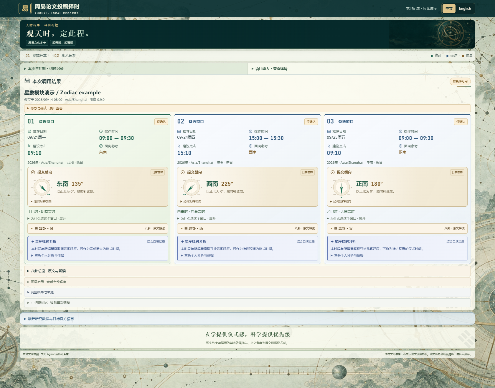
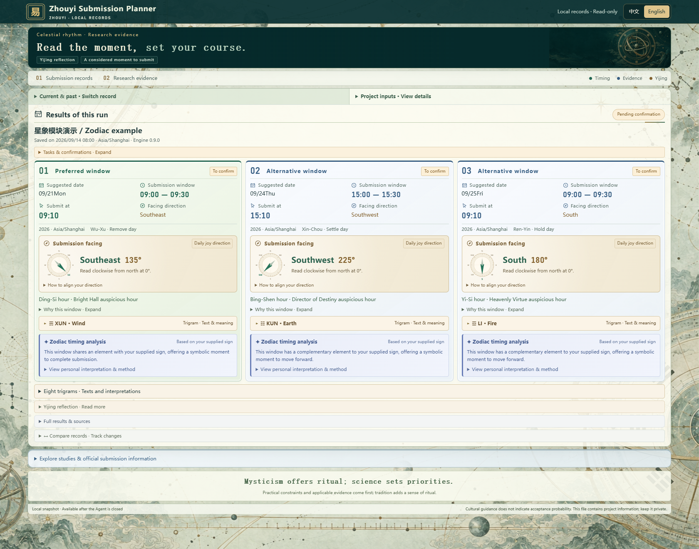
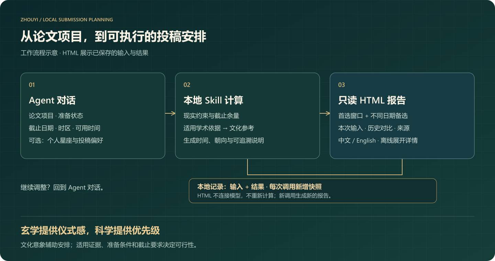
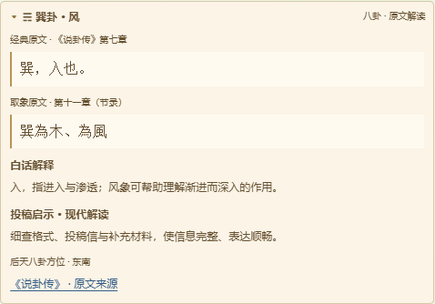

<a href="./README.md">English</a> · <strong>简体中文</strong>

# 周易论文投稿择时

**结合论文准备进度、截止时间与个人日程，给出可执行的投稿安排，融入周易启示与可选的个人星座文化参考。**

这是一个用于首次投稿、返修与重投的 Agent Skill。在对话中说明论文项目，即可默认获得三个投稿窗口（以实际可行为准）：本地具体时间、提交朝向、选择依据，以及可独立打开的 HTML 报告。

<strong>玄学提供仪式感，科学提供优先级。</strong>

v0.9.0 · Node.js 22+ · 本地计算 · 离线中英文 HTML · MIT

[页面预览](#页面预览) · [快速开始](#快速开始) · [功能一览](#功能一览) · [时间如何排序](#时间如何排序) · [常用命令](#常用命令) · [常见问题](#常见问题)

## 页面预览

以下为真实 v0.9.0 HTML 模板的中英文截图，使用同一份 [examples/astrology.json 模拟数据](examples/astrology.json)，桌面视口为 1680 × 1320。截图不包含私人项目历史；切换界面语言后，项目原文仍保留原来的中英文内容。

### 中文界面

展开英文界面预览

## 一图了解

*从项目资料到保存结果：Agent、本地引擎与 HTML 各司其职。*

需要调整时，继续在 Agent 对话中提出；每次新推荐都会保存新记录与 HTML 快照。

## 功能一览

| 功能 | 你会得到什么 |
|---|---|
| 结合论文项目 | 投稿阶段、准备条件、最早就绪时间、可用时段、排除区间与截止限制 |
| 窗口对比 | 默认 3 个，可配置 1–10 个；优先不同日期，再补充不重叠时段 |
| 具体提交时间 | 本地日期、时区、操作时段、建议点击时刻与截止余量 |
| 提交朝向 | 方向名称、顺时针方位角、固定北向罗盘与对齐步骤 |
| 窗口选择依据 | 已有的日课与时辰因素、方位来源、分钟安排和周易启示 |
| 八卦原文解读 | 按朝向对应后天八卦，展示卦象、经典原文、白话解释与投稿启示；附可展开的八卦总览 |
| 学术参考 | 分别展示研究样本，以及已保存的目标官网要求、编辑部信息与截止依据 |
| 个人星座择时 | 根据自填星座加入文化分析，排序位于现实安排与学术依据之后 |
| 紧凑报告 | 对齐的窗口卡片、可展开详情、本地搜索与往期记录对比 |
| 中英文切换 | 离线切换界面，保留当前记录、展开状态和项目原文 |
| 投稿计划管理 | 对比、选定、变更复核、准备任务倒排、实际提交确认记录 |
| 多格式输出 | HTML、中英文 Markdown、JSON、候选日历事件与方位示意图 |

界面采用青玉与鎏金配色，配合天文仪器和罗盘意象；背景插画随报告嵌入，字体使用本机通用字体，无需外部字体服务。

## 快速开始

### 1. 准备 Skill 文件夹

在[仓库首页](https://github.com/Mickey5920/zhouyi-paper-submit-advisor)选择 **Code → Download ZIP** 并解压，保留完整的 **zhouyi-paper-submit-advisor** 文件夹，包括 `SKILL.md`、脚本、结构定义、模板和图片。将其放入你的 Agent 宿主支持的 Skill 目录；具体目录和识别方式取决于宿主。

安装 **Node.js 22 或更高版本**及 npm，在该文件夹中执行：

~~~sh
npm ci --ignore-scripts
~~~

此步骤安装锁定版本的依赖；未缓存时需要访问软件包仓库。安装后，本地引擎与导出的 HTML 不需要 AI API Key。Agent 宿主本身的模型与权限按其配置运行。

### 2. 在 Agent 中调用

> 使用 $zhouyi-paper-submit-advisor，结合我指定的论文项目，安排下周三个投稿窗口。我目前处于返修阶段，使用 Asia/Shanghai 时区。给出具体本地时间、提交朝向和已有依据，最后生成本地 HTML 报告。缺少必要的项目事实时再向我确认。

可以继续补充：

> 我的星座是处女座，把个人星座作为文化偏好加入择时分析。

> 周三上午不方便，其余条件保持不变，重新生成报告。

> 保留已经选定的计划，按新的截止时间复核。

Agent 将自然语言要求整理为经过校验的输入，仅按需读取指定项目。命令行程序不会自行遍历资料或查询期刊网站。

### 3. 运行可复现示例

~~~sh
node scripts/cli.js recommend examples/project.json --out runs/readme-demo
~~~

直接用浏览器打开 **runs/readme-demo/report.html**，右上角 **中文 / English** 可切换界面。查看报告不需要启动本地服务。

示例采用固定的模拟日期和截止时间。真实使用时，需要替换项目、准备进度、可用时段和截止信息，并移除 `now`。每次 `--out` 必须使用新路径；再次运行时换一个输出目录即可。

## 需要提供什么

| 信息 | 用途 |
|---|---|
| 项目标题与投稿阶段 | 确认当前稿件，以及首次投稿、返修或重投 |
| 准备状态与剩余待办 | 将未完成材料、待确认的作者同意纳入安排 |
| 所在时区 | 正确显示操作时间，使用 `Asia/Shanghai` 等 IANA 时区名称 |
| 推荐范围 | 下一个自然周、未来七天，或自定义范围 |
| 截止状态 | 记录已知时间与来源、明确没有固定截止，或尚未确认 |
| 可用与排除时段 | 让推荐符合你的实际日程 |
| 目标期刊或会议 | 对应官网要求和适用的学术依据 |
| 个人星座，可选 | 添加象征性择时分析，无需生日、出生时间或出生地 |

未知截止时间可以如实记录；必要的待确认条件会体现在结果状态和保存记录中。

结构化输入中，`preferences.count` 接受 1–10 的整数。`next_week` 指下周一至再下周一（不含终点）；滚动七天使用 `rolling_7_days`。

[项目示例](examples/project.json) · [个人星座示例](examples/astrology.json) · [完整输入结构](schemas/input.schema.json)

## 时间如何排序

准备条件、可用时间和硬截止决定窗口是否可行。在可行窗口中，当前排序依次考虑：

1. 截止余量。
2. 已核验且适用于目标期刊或会议的学术时间偏好。
3. 用户偏好的操作时段。
4. 传统日历偏好。
5. 个人星座的文化匹配，作为最后一级比较。

系统优先选择不同日期，数量不足时再补充可用的不重叠窗口。适用学术依据与传统择时发生冲突时，报告会解释实际选择。通用研究摘要不会自动变成“周末扣分”；只有明确核验适用性后，目标相关的星期偏好才参与排序。

| 参考层次 | 当前实现 |
|---|---|
| 中国历法 | 固定版本历法规则，支持 `Asia/Shanghai` 下的日课、时辰与日家喜神方位；其他时区保留现实安排并标注传统计算范围 |
| 周易启示 | 乾、謙两篇中的四条有来源短引文，以及现代论文项目解读 |
| 个人星座 | Astronomy Engine 本地星历；将自填太阳星座与当时月亮星座做声明过的四元素文化映射，仅作末级排序 |
| 学术条件 | 已保存的研究快照，以及 Agent 核验的目标投稿说明、公开编辑部信息、截止要求和适用时间依据 |

建议点击分钟用于预留核对和回执检查时间。罗盘是固定北向示意，不会实时读取位置。文化因素不用于计算论文录用概率。

个人星座可以不填；未填写时，HTML 不显示个人分析。设置 `astrology.enabled` 为 `false` 可关闭该模块。星历支持范围为 1900–2100，计算约定见 [SKILL.md](SKILL.md)。

八卦原文采用《说卦传》第七章及第十一章节录，方位约定与引文出处见[八卦参考说明](references/bagua.md)。每个窗口默认收起详情，展开即可阅读“原文—白话解释—现代投稿启示”；此层用于文化解读，不改变时间排序。

## 报告与本地记录

有候选窗口时，一次推荐生成：

~~~text
runs/readme-demo/
  report.html               离线中英文报告与历史快照
  input.json                完整的已保存输入
  record.json               输入与结果配对记录
  recommendations.json      结构化结果与来源
  report.md                 中文 Markdown 报告
  report.en.md              英文 Markdown 报告
  manifest.json             运行标识与版本
  submission-windows.ics    候选日历事件，不含闹钟
  direction.svg             首选窗口固定北向示意图
~~~

日历和方位文件在存在候选窗口时生成。每次调用还会在 `.local-data/history/` 新增独立记录。更新 Skill 时保留这个私人目录，即可延续本地历史。

`runs/` 和 `.local-data/` 已被 Git 忽略。导出的报告仍包含你提供的项目资料，公开展示请使用模拟示例。

只想从现有历史导出 HTML，不重新计算或增加记录：

~~~sh
node scripts/cli.js history-html --out runs/history-view.html
~~~

HTML 已嵌入生成时的记录、样式、图片和展示逻辑；导出后不会自动读取新增记录或刷新网络来源。新调用或重新导出历史会生成更新后的快照。语言按钮切换内置界面说明，用户原文、原始引文和 JSON 保留原语言。浏览器允许本地存储时会记住语言偏好。

## 常用命令

完成快速开始中的示例后，在 Skill 根目录执行以下命令。每个保存路径都需使用新名称。

~~~sh
node scripts/cli.js compare runs/readme-demo/recommendations.json 1 2
node scripts/cli.js select runs/readme-demo/recommendations.json 1 --out runs/selected-plan.json
node scripts/cli.js patch examples/project.json examples/patch.json --out runs/updated-input.json
node scripts/cli.js review runs/selected-plan.json runs/updated-input.json --out runs/reviewed-plan.json
node scripts/cli.js recommend runs/updated-input.json --out runs/updated-run
node scripts/cli.js render runs/readme-demo/recommendations.json en detailed
node scripts/cli.js backplan examples/tasks.json
~~~

纯经文解读与用户提供的六爻记录：

~~~sh
node scripts/cli.js recommend examples/cultural.json --out runs/reflection-demo
node scripts/cli.js recommend examples/lines.json --out runs/lines-demo
~~~

六爻模式接受从下到上提供的六个数值，并转换动爻。选定、复核和实际提交记录通过 Agent 或命令行执行，报告保持只读。实际提交确认与其他选项见[完整命令说明](docs/COMMANDS.md)。

## 常见问题

**HTML 会调用 AI 模型吗？** 不会。它展示已嵌入的本地记录，页面安全策略禁止网络连接。仅当你主动点击来源链接时，才会打开对应网站。

**关闭 Agent 后还能看吗？** 可以。保留导出的 HTML 文件，之后直接从本机打开即可。

**为什么不足三个窗口？** 准备条件、范围、可用时段、排除区间或截止可能只留下更少的可行窗口，可以回到 Agent 调整。

**切换英文会重新推算吗？** 不会，仅切换已有快照的展示语言。

**参考书目中的方法都已经实现了吗？** 书目说明可参考范围，当前计算能力以上表为准。梅花易数、奇门、个人八字、真太阳时和完整六十四卦注解属于后续工作。

**会自动投稿或设置提醒吗？** 当前 Skill 负责规划与记录，不操作投稿网站。ICS 是不含闹钟的候选事件；实际提醒需要宿主提供可用且已授权的工具。

## 仓库结构与开发

~~~text
SKILL.md              Agent 入口
agents/               宿主元数据
scripts/              计算、报告、计划管理与打包
web/                  离线 HTML 模板、样式与翻译
schemas/              输入输出校验结构
config/               操作默认值
examples/             用于演示的模拟输入
references/           Agent 指引与证据规则
data/                 经文选段与参考快照
assets/               界面背景、宣传图片与示意图
tests/                行为与集成测试
docs/                 项目指导、命令与实施历史
~~~

~~~sh
npm test
npm run check
~~~

仓库包含 Windows/Linux、Node 22/24 的 [GitHub Actions 配置](.github/workflows/test.yml)。当前执行结果见仓库的 [Actions 页面](https://github.com/Mickey5920/zhouyi-paper-submit-advisor/actions)。

欢迎附带可复现示例的改进。代码变更应保持时区计算正确、历史记录不可变、来源可追溯，并区分实证依据与文化解读。

遇到问题或有改进建议，可在 [Issues](https://github.com/Mickey5920/zhouyi-paper-submit-advisor/issues) 提供模拟示例、预期行为和 Node.js 版本。

## 文档与图片

[完整项目指导](docs/PROJECT-GUIDE.md) · [实施历史](docs/IMPLEMENTATION.md) · [Agent 输出指南](docs/WORKBENCH.md) · [学术证据规则](references/academic-evidence.md) · [中文示例报告](docs/example-report.zh.md)

项目指导文件包含后续规划，当前可用能力请结合本文功能表和实施记录阅读。

代码和原创文档采用 [MIT 许可证](LICENSE)。第三方资料保留各自适用条款，见[第三方说明](THIRD_PARTY_NOTICES.md)。宣传插画的生成记录见[图片来源](assets/marketing/PROMPTS.md)；流程示意图以可编辑 SVG 保存在 `assets/diagrams/`。
