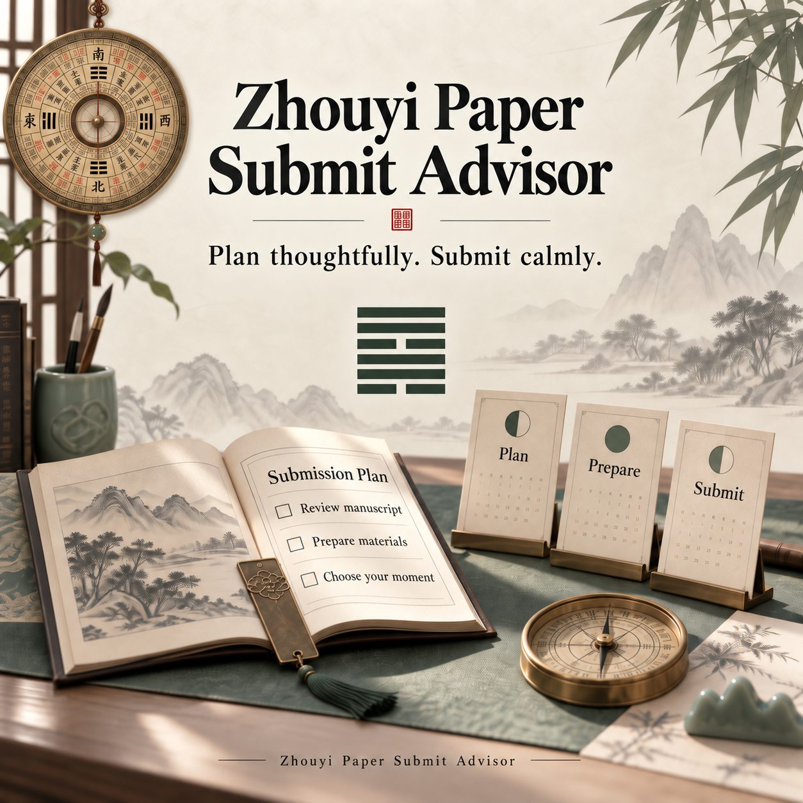
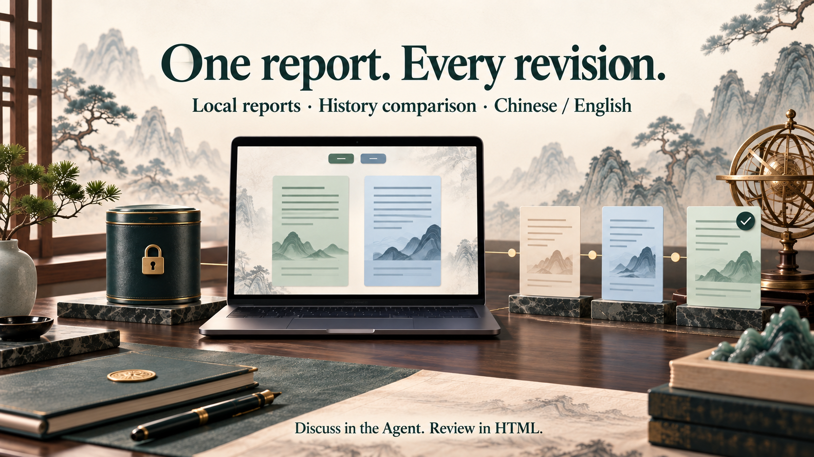
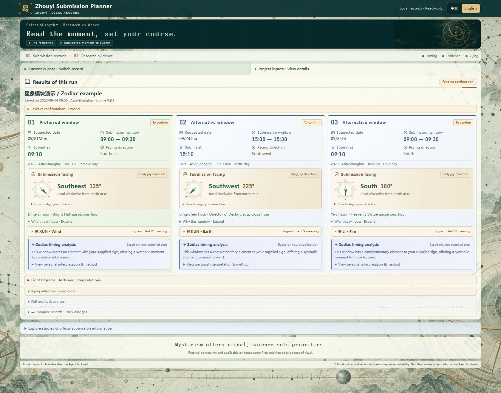
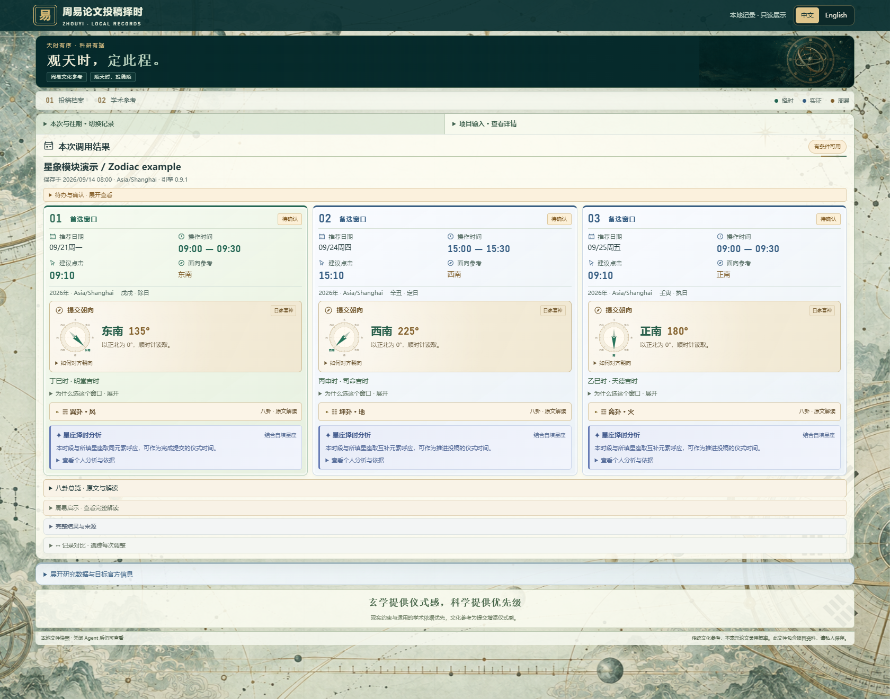
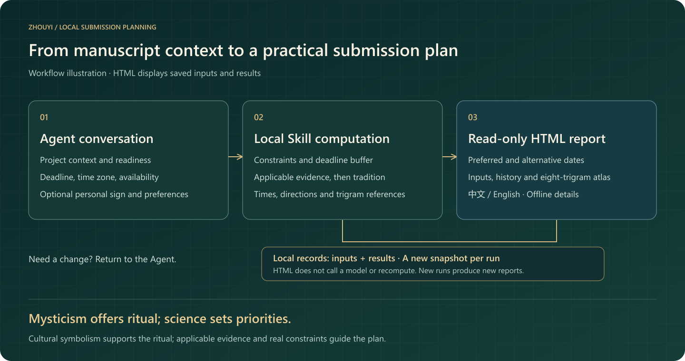
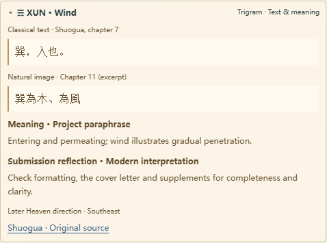
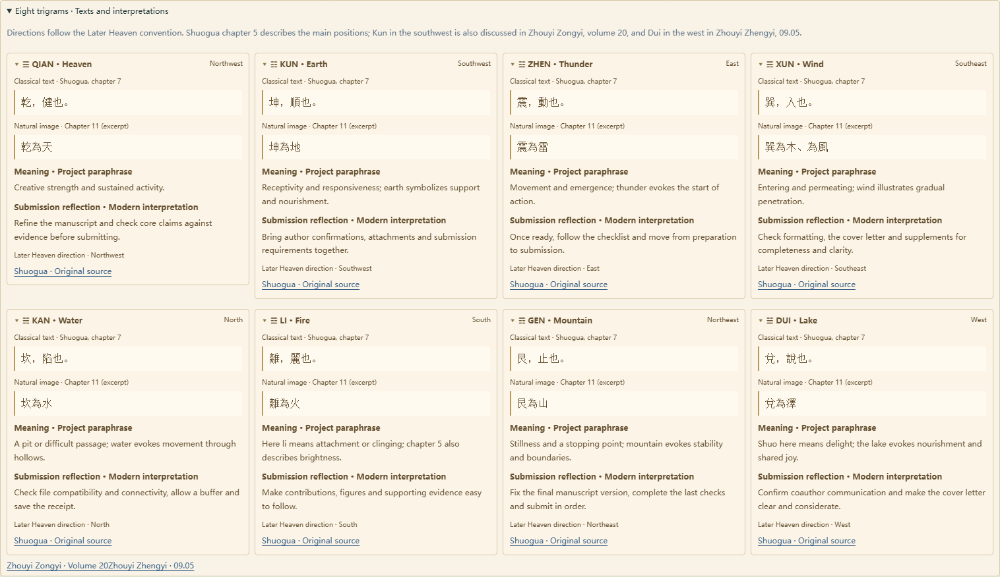

<a href="../README.md">简体中文</a> · <strong>English</strong>

> Complete submission workflow and v0.9.1 interface examples. The default entry is now the [Research Almanac](../README.en.md); submission also remains available independently.

# Submission support guide

**Turn your manuscript's readiness, deadlines and availability into a practical submission plan—with Yijing reflection and optional personal zodiac symbolism.**

An Agent Skill for initial submissions, revisions and resubmissions. Describe your project in the Agent conversation; receive three submission windows by default when feasible with exact local times, facing directions, explanations and a portable HTML report.

<strong>Mysticism offers ritual; science sets priorities.</strong>

v0.9.1 · Node.js 22+ · Local computation · Offline bilingual HTML · MIT

[Page previews](#page-previews) · [Quick start](#quick-start) · [Features](#features) · [How ranking works](#how-ranking-works) · [Commands](#commands) · [FAQ](#faq)

## Features

### 01 · Turn “submit next week” into an actionable plan

**Bring manuscript readiness, available time and facing guidance into one plan.**

| Capability | What it gives you |
|---|---|
| Project-aware scheduling | Initial submission, revision or resubmission, readiness, remaining tasks, availability and deadline constraints |
| Preferred and alternative windows | Three by default, configurable from 1–10; different dates first, then non-overlapping times |
| Exact operation times | Local dates, time zones, operation intervals, suggested click times and deadline margins |
| Facing guidance | Direction, clockwise bearing, a north-up compass and alignment instructions |
| Ongoing plan management | Compare windows, select a plan, review changed conditions, backplan tasks and record a confirmed submission |

### 02 · Classical passages to reflect on. Evidence to prioritize.

**See why a window was chosen and where its interpretation comes from.**

| Capability | What it gives you |
|---|---|
| Trigrams with original passages | A Later Heaven trigram matched to the saved direction, with classical text, plain-language meaning and submission reflection |
| Eight-trigram atlas | All eight references together; Chinese source passages remain intact in English |
| Reasons for each window | Available day, hour and direction factors, separating traditional interpretation from practical planning |
| Academic references | Study summaries alongside saved journal requirements, editorial office information and deadline sources |
| Personal zodiac analysis | Optional supplied sun sign used for cultural timing analysis after practical and academic priorities |

Practical constraints determine feasibility. Applicable, verified academic evidence informs priority; traditional timing and personal zodiac symbolism add cultural context. See [how ranking works](#how-ranking-works).

### 03 · Keep your plan—and each revision—in a portable report

**Discuss changes in the Agent. Open the HTML to review them.**

| Capability | What it gives you |
|---|---|
| Compact report | Aligned preferred and alternative cards, prominent times and expandable details |
| Local records and comparison | Saved input/result pairs, search and comparisons with previous records included at generation |
| Chinese / English | Offline interface switching that preserves the selected record, open details and original project text |
| Standalone HTML | Embedded background artwork and read-only local records, with no AI connection or server required |
| Portable formats | HTML, bilingual Markdown, JSON, candidate calendar events and a direction schematic |

*These are conceptual feature illustrations. The actual interface, data and trigram diagrams appear in the product screenshots below.*

## Page previews

The same synthetic record is shown in both languages, rendered from the actual v0.9.1 HTML template using [examples/astrology.json](../examples/astrology.json). Captured at a 1680 × 1320 desktop viewport. These are product screenshots; they contain no private project history. Original project text remains bilingual when the interface is switched.

### English interface

View the Chinese interface

## At a glance

*From project context to saved results: the Agent, calculation engine and HTML each have a clear role.*

Make adjustments in the Agent conversation. Each new recommendation saves a new record and HTML snapshot.

## Quick start

### 1. Prepare the Skill folder

Use **Code → Download ZIP** on the [repository page](https://github.com/Mickey5920/zhouyi-paper-submit-advisor), then extract it. Keep the complete folder named **zhouyi-paper-submit-advisor**, including `SKILL.md`, scripts, schemas, templates and assets. Place it in the Skill directory supported by your Agent host; the location and discovery mechanism depend on the host.

Install **Node.js 22 or later** and npm. In this folder, run:

~~~sh
npm ci --ignore-scripts
~~~

This installs pinned dependencies and requires package-registry access unless they are cached. After installation, the local engine and exported HTML do not need an AI API key. Your Agent host has its own model and permission settings.

### 2. Invoke it in the Agent

> Use $zhouyi-paper-submit-advisor for my paper project. I am preparing a revision and use Asia/Shanghai time. Suggest three submission windows next week, show exact local times and facing directions, explain the available factors, and return the local HTML report. Ask me for any essential missing project facts.

Optional follow-ups:

> My sign is Virgo. Include personal zodiac timing as a cultural preference.

> Wednesday morning is unavailable. Keep the other constraints and generate a new report.

> Keep the selected plan and review it against the updated deadline.

The Agent maps your natural-language request to validated inputs. It reads only the project context relevant to the request. The CLI does not independently crawl your files or browse journal websites.

### 3. Try the reproducible demo

~~~sh
node scripts/cli.js recommend examples/project.json --out runs/readme-demo
~~~

Open **runs/readme-demo/report.html** directly in your browser. Use **中文 / English** in the top right to switch the interface. No local server is required.

The example uses a frozen synthetic date and deadline. For a live request, replace its project details, readiness, availability and deadline, and omit `now`. Every `--out` destination must be new; choose another directory when rerunning.

## What to provide

Expand the input checklist

| Information | Purpose |
|---|---|
| Project title and submission stage | Identify the manuscript and distinguish initial submission, revision or resubmission |
| Readiness and remaining tasks | Avoid treating unfinished materials or unconfirmed author approval as ready |
| Time zone | Display all operational times correctly; use an IANA identifier such as `Asia/Shanghai` |
| Planning range | Next calendar week, a rolling seven-day range, or a custom range |
| Deadline status | Record a known timestamp and source, explicitly no fixed deadline, or unknown status |
| Available and excluded times | Keep recommendations compatible with your schedule |
| Target journal or conference | Associate official instructions and applicable academic evidence with the correct venue |
| Personal sign, optionally | Add symbolic timing analysis without birth date, birth time or birthplace |

A target with no known deadline can still be represented honestly. Essential uncertainty appears in the result status and saved conditions.

For structured input, set `preferences.count` to an integer from 1–10. `next_week` means the next Monday through the following Monday (end excluded); use `rolling_7_days` for a rolling range.

[Project example](../examples/project.json) · [Personal zodiac example](../examples/astrology.json) · [Input schema](../schemas/input.schema.json)

## How ranking works

Preparation, availability and hard deadlines determine which windows are feasible. Among feasible windows, the current priority order is:

1. Deadline buffer.
2. Verified, applicable academic timing preference for the target venue.
3. Your preferred hours.
4. Traditional calendar preference.
5. Personal zodiac symbolism as the final cultural tie-breaker.

The engine prioritizes different dates, then fills remaining places with non-overlapping windows when available. When applicable academic evidence conflicts with cultural timing, the report explains the choice. A general study summary does not automatically penalize weekends: target-specific applicability must be established before a weekday preference affects ranking.

| Reference layer | Current implementation |
|---|---|
| Chinese calendar | Pinned calendar rules for day/hour labels and daily Xi-shen direction in `Asia/Shanghai`; other zones retain practical scheduling with limited traditional coverage |
| Yijing reflection | Four sourced excerpts from 乾 (The Creative) and 謙 (Modesty), with modern project interpretations |
| Personal zodiac | Local ephemeris from Astronomy Engine; a declared elemental mapping between the supplied sun sign and calculated Moon sign, used only at the last ranking level |
| Academic context | Stored research snapshots plus Agent-verified target instructions, published office details, deadlines and applicable timing evidence |

Specific click minutes reserve time for checks and receipts. The compass is a fixed-north guide, not a live location sensor. Cultural factors do not estimate manuscript acceptance probability.

Personal zodiac input is optional. Without it, the HTML omits personal analysis. Set `astrology.enabled` to `false` to disable the module. Ephemeris support is limited to 1900–2100; conventions are documented in [SKILL.md](../SKILL.md).

The eight-trigram layer uses excerpts from Shuogua chapters 7 and 11. See [the reference notes](../references/bagua.md) for directional conventions and sources. Each window keeps details collapsed until opened: classical text, plain-language meaning and modern submission reflection. This layer does not alter timing scores.

Explore all eight trigrams: original passages and interpretations

## Reports and local records

A recommendation with candidates produces:

~~~text
runs/readme-demo/
  report.html               Offline bilingual report and history snapshot
  input.json                Exact saved input
  record.json               Paired input/result record
  recommendations.json      Structured results and sources
  report.md                 Chinese Markdown report
  report.en.md              English Markdown report
  manifest.json             Run identifiers and versions
  submission-windows.ics    Candidate calendar events, without alarms
  direction.svg             Preferred-window north-up direction schematic
~~~

Calendar and direction files are produced when candidates exist. Each invocation also appends an independent record under `.local-data/history/`. Keep this private directory if you want history to continue across Skill updates.

`runs/` and `.local-data/` are excluded from Git. Exported reports still contain your supplied project information; share synthetic examples for public demonstrations.

To export current history without recalculating or adding a record:

~~~sh
node scripts/cli.js history-html --out runs/history-view.html
~~~

The resulting HTML embeds the available records, styles, images and display logic. It does not fetch new records or refresh sources after export. A new invocation or history export produces an updated snapshot. The language switch translates built-in presentation text; user-written content, original quotations and raw JSON retain their original language. Language preference is remembered when browser local storage is available.

## Commands

Expand command-line usage

After running the quick-start demo, use these commands from the Skill folder. Each saved output path must be new.

~~~sh
node scripts/cli.js compare runs/readme-demo/recommendations.json 1 2
node scripts/cli.js select runs/readme-demo/recommendations.json 1 --out runs/selected-plan.json
node scripts/cli.js patch examples/project.json examples/patch.json --out runs/updated-input.json
node scripts/cli.js review runs/selected-plan.json runs/updated-input.json --out runs/reviewed-plan.json
node scripts/cli.js recommend runs/updated-input.json --out runs/updated-run
node scripts/cli.js render runs/readme-demo/recommendations.json en detailed
node scripts/cli.js backplan examples/tasks.json
~~~

For text-only cultural reflection or user-supplied six-line recording:

~~~sh
node scripts/cli.js recommend examples/cultural.json --out runs/reflection-demo
node scripts/cli.js recommend examples/lines.json --out runs/lines-demo
~~~

Six-line mode accepts six user-supplied values, bottom to top, and transforms moving lines. Selection, review and submission recording are Agent/CLI actions; the report stays read-only. See [all commands](../docs/COMMANDS.md) for actual submission confirmation and further options.

## FAQ

**Does the HTML call an AI model?** No. It displays embedded local records, and its security policy blocks network connections. Source links open only when you choose to visit them.

**Can I use the report after closing the Agent?** Yes. Keep the exported HTML file. It is self-contained and can be opened from disk.

**Why are there fewer than three windows?** Your readiness, range, availability, exclusions or deadline may leave too few feasible windows. Adjust these through the Agent.

**Does changing language recompute the plan?** No. It changes the presentation of the existing snapshot.

**Are all the reference books implemented as calculation engines?** The book catalog describes reference scope. Current calculation support is listed above. Meihua, Qimen, personal Bazi, true solar time and full 64-hexagram commentary are future work.

**Will it submit my paper or create reminders?** The Skill plans and records; it does not operate a submission portal. ICS files contain candidate events without alarms. Actual reminders require an available, authorized host tool.

## Repository and development

~~~text
SKILL.md              Agent entrypoint
agents/               Host metadata
scripts/              Calculation, reports, plan lifecycle and packaging
web/                  Offline HTML templates, styles and translations
schemas/              Input/output validation contracts
config/               Operational defaults
examples/             Synthetic inputs for local demonstrations
references/           Focused Agent instructions and evidence rules
data/                 Curated excerpts and reference snapshots
assets/               Interface art, promotional images and diagrams
tests/                Behavioral and integration tests
docs/                 Project guide, commands and implementation history
~~~

~~~sh
npm test
npm run check
~~~

The repository includes [GitHub Actions configuration](../.github/workflows/test.yml) for Node 22/24 on Windows and Linux. See the [Actions page](https://github.com/Mickey5920/zhouyi-paper-submit-advisor/actions) for current CI results.

Contributions should include a reproducible example and preserve time-zone correctness, immutable records, source traceability and the separation between empirical evidence and cultural interpretation.

Found an issue or have an idea? [Open an issue](https://github.com/Mickey5920/zhouyi-paper-submit-advisor/issues) with a synthetic example, expected behavior and your Node.js version.

## Documentation and artwork

[Project guide (Chinese)](../docs/PROJECT-GUIDE.md) · [Implementation history](../docs/IMPLEMENTATION.md) · [Agent output guide](../docs/WORKBENCH.md) · [Academic evidence rules](../references/academic-evidence.md) · [English sample report](../docs/example-report.en.md)

The project guide includes planned features. Use the current capability table and implementation notes to distinguish available functions from the roadmap.

Code and original documentation: [MIT License](../LICENSE). Third-party materials retain their applicable terms; see [third-party notices](../THIRD_PARTY_NOTICES.md). Generated promotional artwork is documented in [image provenance](../assets/marketing/PROMPTS.md); workflow diagrams are editable SVGs in `assets/diagrams/`.

Feature illustration prompts: [generation records](../assets/marketing/features/PROMPTS-v2.md).
